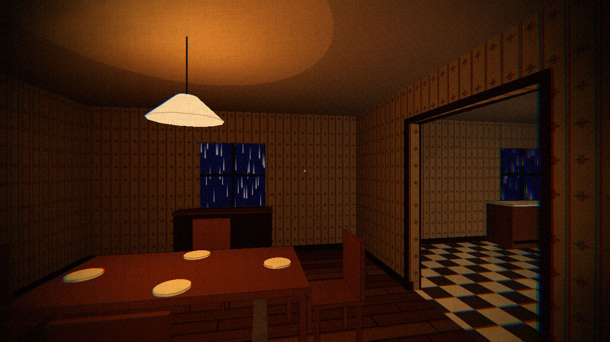
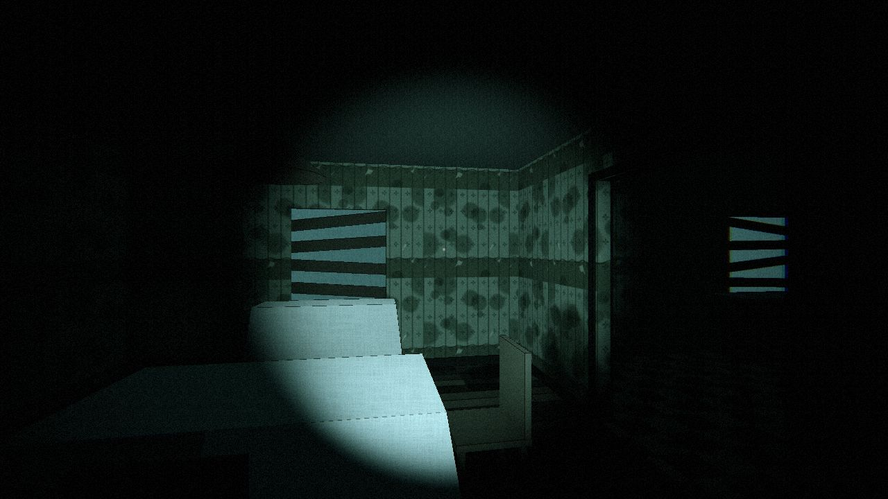

# STILL HERE

A two-player asymmetric co-op psychological horror game for the web. One player is **Nora**, on a
stormy night in 1994. The other is **Sam**, her little brother, decades later in the abandoned
family house. Get on a call. Never show each other your screen.

> Design: [`GAME_DESIGN.md`](GAME_DESIGN.md) · Architecture: [`docs/ARCHITECTURE.md`](docs/ARCHITECTURE.md)
> · Status: **M1 (greybox house)**: walkable ground floor + basement in both timelines.
> · **Play it in the browser:** https://claude.ai/artifact/VHXzRj8NB92Kg7DaPTdrXS (private until
> shared from the page's Share menu).

| Nora · 1994                                        | Sam · present                                       |
| -------------------------------------------------- | --------------------------------------------------- |
|  |  |

## Requirements

Node 20+ (developed on Node 22).

## Run locally

```bash
npm install
npm run dev
```

Open http://localhost:5173. This starts the Vite client and the realtime server (port 8787)
together; Vite proxies `/ws` and `/health` to the server.

### Controls

| Key       |                                                                                                   |
| --------- | ------------------------------------------------------------------------------------------------- |
| W A S D   | move (arrow keys work too)                                                                        |
| mouse     | look (click the game to capture it)                                                               |
| shift     | run                                                                                               |
| C         | crouch (toggle)                                                                                   |
| E / click | use the thing under the dot                                                                       |
| F         | flashlight (Sam only)                                                                             |
| esc       | pause: controls, mouse sensitivity, invert look, head bob, quality, film effects, reduce flashing |

### Dev options

Until pairing lands in M2, pick a character with the URL: `?as=nora` (default) or `?as=sam`.

| URL param                     |                                                       |
| ----------------------------- | ----------------------------------------------------- |
| `?as=sam`                     | play Sam (present day)                                |
| `?notitle`                    | skip the title card (keys work without mouse capture) |
| `?pos=x,y,z&yaw=90&pitch=-10` | start somewhere specific (yaw 0 = north)              |

In dev builds, `T` swaps to the other timeline in place, and the bottom-left readout shows room,
position, fps and server status. `window.__still` exposes the engine, player and house for the
console.

### Trying M1

- **Nora:** the lamps flicker, the TV glows in the living room, the clock in the hall is running,
  rain runs down the windows, and lightning flashes through them. Open the door in the hall's
  north end and go down the stairs to the basement.
- **Sam (`?as=sam`):** the same house decades later. Flashlight on `F`, dust sheets over the
  furniture, chairs knocked over, the plates gone, water on the floor, boarded windows, the clock
  stopped at 3:17. The basement door is **bolted from the hall side**: aim at the bolt beside the
  door (chest height) to slide it, then open the door.
- **Looking closer:** things that matter for the puzzles glow faintly when you look at them and
  the dot says "look". Press E or click to lean in: the camera frames the object, with its name,
  one short line, and a faint line of family history that fades in (lore can be turned off
  in the pause menu).
  E or click again steps back. Try the walkie-talkie, Mum's answering machine (Sam), the music
  box (Nora), the clock, the photos, the piano and the valves in the basement.
- **Sound (wear headphones):** everything is placed in 3D. Nora hears rain, thunder after the
  lightning, the clock ticking, the TV murmuring, the boiler, her father pacing upstairs and her
  mother humming. Sam hears wind through the boards, dripping water, footsteps upstairs where
  nobody is, the dead clock ticking once, and, eventually, the same lullaby from the basement,
  slowed down. Footsteps change on wood, tile, concrete and water. Volume is in the pause menu.
- The stairs up are behind a locked door (upstairs comes later). The front door is locked.

### Two players on one machine

From M2 on: open two browser windows (or one normal + one private window) at
http://localhost:5173, create a room in one, join with the code in the other. To use a second
device on your LAN, open the `Network:` URL Vite prints.

## Scripts

|                 |                                                         |
| --------------- | ------------------------------------------------------- |
| `npm run dev`   | client + server with hot reload                         |
| `npm run check` | typecheck, lint, format check, tests                    |
| `npm run build` | typecheck + production build to `dist/`                 |
| `npm start`     | run the server; serves `dist/` too if it has been built |
| `npm test`      | unit tests (Vitest)                                     |

## Deploy

The simplest deploy is **one Node service** that serves the built client and the WebSocket on the
same origin:

```bash
npm ci
npm run build
PORT=8080 npm start
```

Any host that runs a long-lived Node process with WebSockets works: Fly.io, Render, Railway, a
small VPS. Configure:

- build command `npm ci && npm run build`, start command `npm start`
- health check `GET /health`
- a single instance (rooms are in memory)

**Split hosting** (static client on Netlify / Vercel / Cloudflare Pages, server elsewhere): build
the client with `VITE_SERVER_URL=wss://your-server.example.com/ws npm run build`, upload `dist/`,
and run `npm start` on the server host.

## Assets

Greybox for now: primitives plus procedural canvas textures. Real assets will be CC0 low-poly
(Kenney, Quaternius, Poly Pizza) or Blender exports as `.glb` in `public/assets/`.
