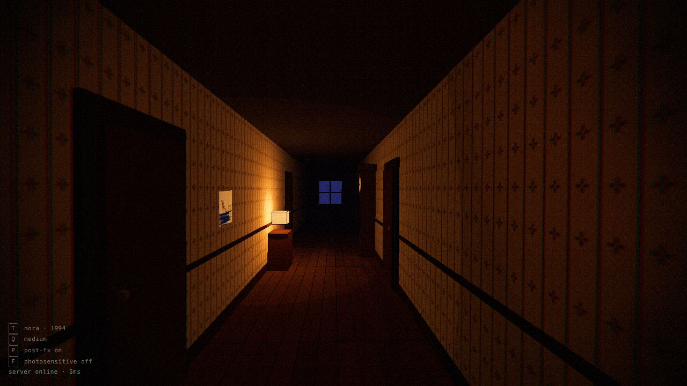
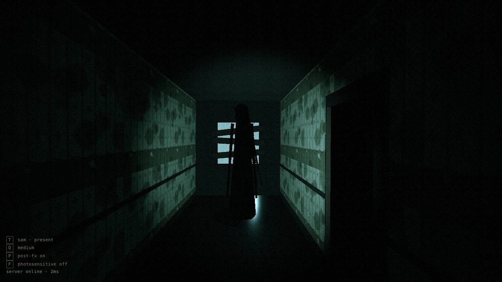

# STILL HERE

A two-player asymmetric co-op psychological horror game for the web. One player is **Nora**, on a
stormy night in 1994. The other is **Sam**, her little brother, decades later in the abandoned
family house. Get on a call. Never show each other your screen.

> Design: [`GAME_DESIGN.md`](GAME_DESIGN.md) · Architecture: [`docs/ARCHITECTURE.md`](docs/ARCHITECTURE.md)
> · Status: **M0 (setup)**: art-direction test scene and server stub.

| Nora · 1994                                 | Sam · present                                   |
| ------------------------------------------- | ----------------------------------------------- |
|  |  |

## Requirements

Node 20+ (developed on Node 22).

## Run locally

```bash
npm install
npm run dev
```

Open http://localhost:5173. This starts the Vite client and the realtime server (port 8787)
together; Vite proxies `/ws` and `/health` to the server.

### M0 controls (dev)

| Key   |                                               |
| ----- | --------------------------------------------- |
| mouse | look around                                   |
| `T`   | swap timeline (Nora 1994 / Sam present)       |
| `Q`   | cycle quality low → medium → high             |
| `P`   | post-processing on/off                        |
| `F`   | photosensitive mode (tames lightning/flicker) |

URL params: `?timeline=present`, `?notitle`, `?camz=-4` (pin camera; try it in the present to
meet the thing at the end of the hall).

### Two players on one machine

From M2 on: open two browser windows (or one normal + one private window) at
http://localhost:5173, create a room in one, join with the code in the other. To use a second
device on your LAN, open the `Network:` URL Vite prints.

## Scripts

|                 |                                                         |
| --------------- | ------------------------------------------------------- |
| `npm run dev`   | client + server with hot reload                         |
| `npm run check` | typecheck, lint, format check, tests                    |
| `npm run build` | typecheck + production build to `dist/`                 |
| `npm start`     | run the server; serves `dist/` too if it has been built |
| `npm test`      | unit tests (Vitest)                                     |

## Deploy

The simplest deploy is **one Node service** that serves the built client and the WebSocket on the
same origin:

```bash
npm ci
npm run build
PORT=8080 npm start
```

Any host that runs a long-lived Node process with WebSockets works: Fly.io, Render, Railway, a
small VPS. Configure:

- build command `npm ci && npm run build`, start command `npm start`
- health check `GET /health`
- a single instance (rooms are in memory)

**Split hosting** (static client on Netlify / Vercel / Cloudflare Pages, server elsewhere): build
the client with `VITE_SERVER_URL=wss://your-server.example.com/ws npm run build`, upload `dist/`,
and run `npm start` on the server host.

## Assets

Greybox for now: primitives plus procedural canvas textures. Real assets will be CC0 low-poly
(Kenney, Quaternius, Poly Pizza) or Blender exports as `.glb` in `public/assets/`.
